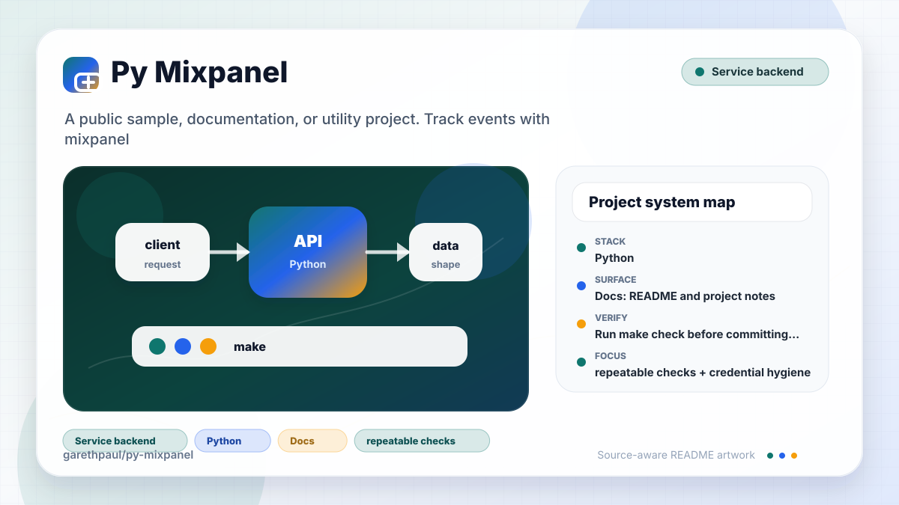

# py-mixpanel

<!-- README-OVERVIEW-IMAGE -->


## Overview

`garethpaul/py-mixpanel` is a public sample, documentation, or utility project. Track events with mixpanel

This README is based on the checked-in source, manifests, scripts, and repository metadata on the `master` branch. The project language mix found during review was: Python (1).

## Repository Contents

- `README.md` - project overview and local usage notes
- `.github/workflows/check.yml` - GitHub Actions baseline for `make check`
- `CHANGES.md` - notable maintenance changes
- `Makefile` - local verification entry points
- `docs/plans` - canonical completed maintenance plans
- `plans` - completed maintenance plans
- `scripts/check-baseline.sh` - repository maintenance baseline guard
- `test_mixpanel.py` - mocked HTTP regression tests
- `SECURITY.md` - security reporting and disclosure guidance
- `VISION.md` - project direction and maintenance guardrails

Additional scan context:

- Source directories: no top-level source directories detected
- Dependency and build manifests: Makefile
- Entry points or build surfaces: mixpanel.py, Makefile
- Test-looking files: test_mixpanel.py

## Getting Started

### Prerequisites

- Git
- Python 2.7 and `make`

### Setup

```bash
git clone https://github.com/garethpaul/py-mixpanel.git
cd py-mixpanel
```

The setup commands above are derived from repository files. Legacy mobile, Python, or JavaScript samples may require older SDKs or package versions than a modern workstation uses by default.

## Running or Using the Project

- Import `EventTracker` from `mixpanel.py`.
- Construct `EventTracker` with a nonblank Mixpanel project token; surrounding
  whitespace is trimmed and blank tokens raise `ValueError`.
- Provide `api_key` only for import calls; when present it must be a nonblank
  string and surrounding whitespace is trimmed.
- Call `track(event, properties)` only after the caller has explicit consent and a caller-provided `distinct_id`.
- Event names must be nonblank strings; blank or non-string event names raise
  `ValueError` before any HTTP request.
- Surrounding whitespace is trimmed from event names before payload encoding
  and callback execution.
- Event properties must be dictionaries.
- Calls without a nonblank string `distinct_id` raise `ValueError` before any
  HTTP request.
- Caller-provided properties are copied before the tracker adds `token` or
  `time`, so validation and payload enrichment do not mutate application data.
- Mixpanel HTTP requests use a ten-second timeout by default.
- Use `track_async` only when background submission is expected by the caller.

## Testing and Verification

- Run `make check` before committing changes.
- Run `make build` for the static legacy verification gate; it uses the same
  mocked Python 2 tests as `make test`.
- Run `scripts/check-baseline.sh` for the SDK-free repository baseline guard.
- GitHub Actions runs `make check` on pushes and pull requests with Python
  3.12. Python 2 syntax and mocked HTTP tests run when `python2` is installed
  and report clear skips otherwise.
- `make check` delegates to `make verify`, which compile-checks the legacy Python 2 files, runs mocked HTTP tests for tracking, import URLs, request validation, request timeouts, request-error behavior, caller-property isolation, and async callback behavior, and verifies completed plans under `docs/plans`.
- The baseline script checks required files, completed docs-plan metadata,
  verification documentation, and local secret/editor metadata hygiene.
- The baseline script also rejects local `.pyc` files and `__pycache__`
  directories after the mocked Python 2 tests run.
- Request validation coverage includes nonblank project tokens, API keys when
  provided, event names, properties dictionaries, and nonblank caller-provided
  distinct IDs.

When the required SDK or runtime is unavailable, use static checks and source review first, then verify on a machine that has the matching platform toolchain.

## Configuration and Secrets

- Detected references to Mixpanel. Keep API keys, OAuth credentials, tokens, and account-specific values in local configuration only.

## Security and Privacy Notes

- Review changes touching authentication or token handling; examples from the scan include mixpanel.py.
- Review changes touching external API calls or credential-adjacent configuration; examples from the scan include mixpanel.py.
- Review changes touching network requests, sockets, or service endpoints; examples from the scan include mixpanel.py.
- Review changes touching file, media, JSON, XML, CSV, OCR, or data parsing; examples from the scan include mixpanel.py.
- Event validation rejects blank event names before analytics payloads are
  encoded or sent.
- Event validation trims surrounding whitespace before analytics payloads are
  encoded or callbacks run.
- Constructor validation rejects blank API keys before import request URLs are
  built.
- Tracking validation rejects non-dict properties and blank distinct IDs before
  analytics payloads are encoded or sent.

## Maintenance Notes

- See `SECURITY.md` for vulnerability reporting and safe research guidance.
- See `VISION.md` for project direction and contribution guardrails.
- See `docs/plans/2026-06-08-py-mixpanel-baseline.md` for the canonical
  mocked Mixpanel tracking baseline.
- See `docs/plans/2026-06-08-request-validation-and-timeout.md` for the
  distinct ID and request-timeout guard baseline.
- See `docs/plans/2026-06-08-request-error-coverage.md` for the mocked request
  failure behavior baseline.
- See `docs/plans/2026-06-09-caller-property-isolation.md` for caller-property
  mutation coverage.
- See `docs/plans/2026-06-09-token-validation.md` for constructor token
  validation coverage.
- See `docs/plans/2026-06-09-api-key-validation.md` for constructor API-key
  validation coverage.
- See `docs/plans/2026-06-09-event-name-validation.md` for event-name
  validation coverage.
- See `docs/plans/2026-06-09-event-name-normalization.md` for event-name
  normalization coverage and the static `make build` alias.
- See `docs/plans/2026-06-09-distinct-id-validation.md` for properties and
  distinct ID validation coverage.
- See `docs/plans/2026-06-09-scripted-baseline-check.md` for the scripted
  repository baseline guard and local secret/editor metadata ignores.
- See `docs/plans/2026-06-09-bytecode-free-verification.md` for the
  bytecode-free legacy verification guard.
- See `docs/plans/2026-06-10-ci-baseline.md` for the lightweight GitHub
  Actions baseline.

## Contributing

Keep changes small and tied to the project that is already present in this repository. For code changes, document the toolchain used, avoid committing generated dependency directories or local configuration, and update this README when setup or verification steps change.
